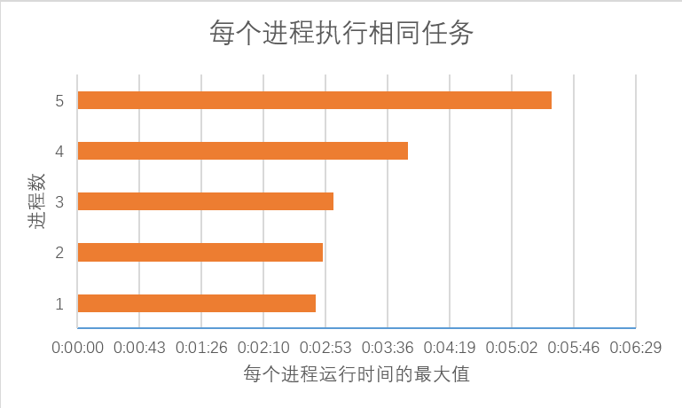

# grib2micaps-util

grib2micaps 批量任务提交工具

grapesGfs_grib2micaps_v3.9.4 版本尚未支持多进程，无法充分利用多核 CPU 的优势。
可以通过同时运行多个 grib2micaps 程序模拟多进程模式。

本项目提供批量执行 grib2micaps 任务的工具，通过配置文件定制批量执行任务。

## 安装

请从正规渠道获取 grib2micaps.exe 程序，本项目不提供该程序。

需要安装 python 3.5 及以上版本。
本项目的 release 中内置轻量级的 64 位 python 环境，可以直接在 64 位操作系统中使用。

## 配置

multi_task_loader.py 默认读取同目录下的 multi_task_loader.config.xml 作为配置文件，或者使用 -c/--config 参数指定配置文件的路径。
配置文件格式如下：

~~~
<?xml version="1.0" encoding="UTF-8"?>
<multi_task_loader>
    <pool_size>2</pool_size>
    <task_list>
        <task>
            <start_time>2016061708</start_time>
            <start_forecast_hour>0</start_forecast_hour>
            <end_forecast_hour>3</end_forecast_hour>
            <run_dir>D:/windroc/project/2016/grib2micaps/grapesGfs_grib2micaps_v3.9.4_0</run_dir>
            <program>grib2micaps.exe</program>
        </task>
        <task>
            <start_time>2016061708</start_time>
            <start_forecast_hour>0</start_forecast_hour>
            <end_forecast_hour>3</end_forecast_hour>
            <run_dir>D:/windroc/project/2016/grib2micaps/grapesGfs_grib2micaps_v3.9.4_1</run_dir>
            <program>grib2micaps.exe</program>
        </task>
    </task_list>
</multi_task_loader>

~~~

### pool_size

进程池数量，即同时运行的进程数。建议不要超过 CPU 核心数。

### task_list

任务列表，由多个 task 构成，task 个数可以大于 pool_size。
每个 task 包含下面几个字段：

#### start_time

起报时间，格式：YYYYMMDDHH。

#### start_forecast_hour

转码的起始时效。

#### end_forecast_hour

转码的终止时效。

#### run_dir

任务运行的目录。

> 因为 Fortran 在 Windows 中无法同时读取同一个文件，无法在同一个目录下运行 grib2micaps.exe 程序。
> 需要为每个任务设置单独的目录。

#### program

执行的程序文件路径。可设置相对于 run_dir 的相对路径。

## 使用

运行 multi_task_loader.py 脚本：

~~~
%PYTHON_EXE% multi_task_loader.py -c %CONFIG_FILE_PATH%
~~~

## 实现

multi_task_loader.py 脚本使用 multiprocessing 库实现多进程调用，并用 subprocess 库生成子进程调用 grib2micaps 程序。

## 性能测试

### 测试机性能

cpu：Intel Core i5-2500 @ 3.3GHz

内存：24GB，可用5.3GB

硬盘：希捷(SEAGATE)4TB 5900转64M SATA3 台式机硬盘(ST4000DM000)

### 转码资料

从气象局 HPC 的 /cma/g2/COMMDATA/OPER/nwp/GMFS_GRIB2_GRAPES/CMACAST 目录下载的 GRAPES_GFS_forCAST_2016061700

### 测试用例

每个进程转码相同的时效，比如4进程0-3表示一共加载4个进程，每个进程都转码0-3时效的grib2文件。

具体测试见下面的表格：

<table>
    <tr>
        <th>进程数</th>
        <th colspan="4" >每个进程转码的时效</th>
    </tr>
    <tr>
        <td>1</td>
        <td>0-3</td>
        <td>0-9</td>
        <td>0-15</td>
        <td>0-21</td>
    </tr>
    <tr>
        <td>2</td>
        <td>0-3</td>
        <td>0-9</td>
        <td></td>
        <td></td>
    </tr>
    <tr>
        <td>3</td>
        <td>0-3</td>
        <td></td>
        <td></td>
        <td></td>
    </tr>
    <tr>
        <td>4</td>
        <td>0-3</td>
        <td></td>
        <td></td>
        <td></td>
    </tr>
    <tr>
        <td>5</td>
        <td>0-3</td>
        <td></td>
        <td></td>
        <td></td>
    </tr>
</table>

### 测试结果分析

#### 每个进程执行相同的任务

测试不同进程数对单个任务运行时间的影响。

每个进程转码2个文件：

可以看到，同时运行的进程数达到或超过CPU核心数时，运行时间会大大延长。

#### 处理相同数量的文件

测试不同进程数是否能加快处理速度。

处理6个文件：

处理8个文件：

可以看到，使用多进程可以加快转码速度。

## 致谢

该项目基于 grapesGfs_grib2micaps_v3.9.4 的改进版本，感谢 grib2micaps 的开发者提供功能强大的转码工具。

## 许可

[MIT]

Copyright 2016, Perilla Roc

[MIT]: https://opensource.org/licenses/MIT